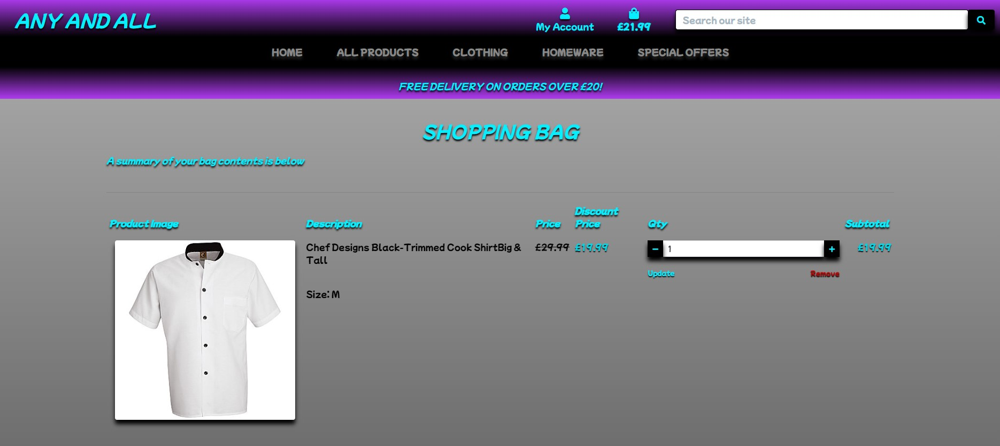

# Any And All

### Live site:

https://any-and-all.herokuapp.com/

Any And All is a B2C E-commerce online shopping site dealing directly from business to customer. Designed with an easy to use navigation to all pages with a search bar that can search any category or price or even key words in any product, making the site very accessible and easy to use for any level of user.
The site consists of a sign up, sign in an sign out ability for ease of second visit saving customer details so check out will be super quick and easy with a secure payment system through Stripe payments so all user details are protected.
The user also has the option of signing up for a newsletter and checking out our Facebook page to stay up to date with all the latest deals and discounted products.
C.R.U.D functionality for users and staff..... 
- For users ~ They can write reviews, edit old reviews and delete them at any time and add things to they're wish list with the same edit, update and delete capabilities but they will need to register for this function.
- For staff ~ They can add, edit, update and delete items in the store with the correct authorization so the average user can not access these areas.
- For store owners ~ They can access the Admin with they're superuser authorization to remove any profanity written in reviews and control anything across the store like users, products, Emails Etc.
---

##  Screen shots of the site and it's responsive abilities:

I used http://ami.responsivedesign.is/ to check what it would look like on all devices.
As you can see it's fully responsive right across all devices and adapts to any screen sizes.

---

- [Back to the top](#any-and-all)

---

# UI/UX

## User stories:

### User stories where built in an Agile methodology Kanban board using the MoSCoW technique MUST have, SHOULD have, COULD have and WON'T have to construct the site and all it's functionality:
---

---

- [Back to the top](#any-and-all)

---

## Then assessed into EPICS 
# Epics

* ## Epic 1 - Store owner control: 

|  User Story Epic  |    User Type   |  Content  |  MoSCoW Label |
| --------------- | -------------- | --------- | -------------|
| [#1] Admin CRUD  |  As a store owner  |  I'd like the ability to create, read, update and delete data on the site so I can control any unwanted profanity in reviews or update any products in the store.  |  Must Have  |
| [#2] Connect to facebook page  |  As a store owner  |  I want to make sure we reach out to other potential customers by connecting our facebook page.|  Must Have  |
| [#3] Contact us  |  As a store owner  |  I'd like to allow our customers to contact us easily with one click so I can help them if they have any problems.|  Must Have  |
| [#4] Send newsletters  |  As a store owner  |  I'd like to send a newsletters out to our subscribed customers so I can update them on our latest deals and discounted items.|  Should Have  |
| [#5] Privacy Policy |  As a store owner  |  I'd like to allow our customers to view the privacy policy at any time so I can give the customer peace of mind.|  Should Have  |
| [#6] Secure payments link |  As a store owner  |  I'd like to allow our customers to check out how we make our payments secure by following the link to Stripe Payments site so I can give the customer peace of mind.|  Could Have  |

* ## Epic 2 - Site users:
|  User Story Epic |    User Type   |  Content  |  MoSCoW Label  |
| --------------- | -------------- | --------- | -------------|
| [#7]  Easy to navigate site  |  As a site user  |  I'd like an easy to navigate site so I can find my way around easily.|  Must Have  |
| [#8] Add to bag  |  As a site user  |  I'd like to add items to the bag before purchasing so I can edit my items before checking out.|  Must Have  |
| [#9] Secure Payments  |  As a site user  | I'd like a site that has a secure payment system so I can keep my details safe.|  Must Have  |
| [#10] Login  |  As a returning user  | I'd like save my details so I can purchase items faster next time.|  Should Have  |
| [#11] Reviews  |  As a site user  | I'd like to read reviews so I can find out what other people think of the products.|  Should Have  |
| [#12] Write reviews  |  As a site user  |  I'd like to write, edit or delete a review so I can share my thoughts on an item.|  Should Have  |
| [#13] Wish list  |  As a site user  |  I'd like to save my favorite items to my wish list so I can buy them at a later date.|  Should Have  |
| [#14] Confirmation email  |  As a site user  |   I'd like a confirmation email so I can check my order details.|  Should Have  |
| [#15] Discounts  |  As a site user  |    I'd like some discounted items so I can save some money on my purchases.|  Should Have  |
| [#16] Coupons  |  As a returning site user  |   I'd like a coupon so I can receive discounts for loyalty.|  could Have/Won't Have  |

* ## Epic 3 - Staff:
|  User Story Epic |    User Type   |  Content  | MoSCoW Label |
| --------------- | -------------- | --------- | -------------|
| [#17]  Product management | As a store owner  | I'd like a manage product page so I can easily add, edit or delete a product.| Must Have |

* ## Epic 4 - Site owner:
|  User Story Epic |    User Type   |  Content  | MoSCoW Label |
| --------------- | -------------- | --------- | -------------|
| [#18]  Links | As a site owner  | I'd like to create links to corresponding page so I can make sure users, staff and store owners are directed to relevant pages.| Must Have |
| [#19]  Functioning E-commerce site | As a site owner  | I'd like build a fully functioning E-commerce site so I can add it to my profile of websites I've create with Code Institute| Must Have |

- [Back to the top](#any-and-all)

## Then prioritized: 

### All of the above user stories were met except coupons marked as Won't Have.

---

- [Back to the top](#any-and-all)

 # Content Requirements:
    
- ## The UI/UX **MUST** address these:

    - Functioning E-commerce site.
    - Easy site navigation with search bar.
    - Connect to facebook page.
    - User and staff C.R.U.D functionality.
    - Correctly coded links.
    - Add to bag functionality.
    - Easy sign up, Log in and Log out system.
    - Authentication, user must not be able to edit or delete anyone else's reviews or access edit product are page.
    - Secure Payments.

- ## The UI/UX **SHOULD** address these:
    
    - Privacy Policy access.
    - Send an email of order confirmation.
    - Leave a review.
    - Subscribe newsletters.
    - Contact us easily.
    - See other peoples reviews.
    - Write a review.
    - Add items to a wish list.
    - Receive a confirmation email.
    - Login for ease of second visit.
    - Discounts products.

- ## The UI/UX **COULD** address this:

    - Secure payments link to see how Stripe works.

- ## The UI/UX **WON'T** address this:

    - Coupons will not be added at this time. 

- [Back to the top](#any-and-all)

---

# The bare bones:

## Wireframes: Created using https://balsamiq.com/wireframes/

The wire frames for the pages showcasing the bare structure of the site.

### Links to the other pages:
- [Products Page](media/any-and-all-wireframe2.jpg)
- [Products detail Page](media/any-and-all-wireframe3.jpg)
- [Products management Page](media/any-and-all-wireframe4.jpg)
- [Profile page](media/any-and-all-wireframe5.jpg)
- [Sign up page](media/any-and-all-wireframe6.jpg)
- [Sign in page](media/any-and-all-wireframe7.jpg)
- [Sign out page](media/any-and-all-wireframe8.jpg)
- [Shopping bag page](media/any-and-all-wireframe9.jpg)
- [Secure checkout page](media/any-and-all-wireframe10.jpg)
- [Reviews page](media/any-and-all-wireframe11.jpg)
- [Wishlist page](media/any-and-all-wireframe12.jpg)

- [Back to the top](#any-and-all)

----

# Database Schema

## ***`Draw SQL`*** 
was used to create the database schema https://drawsql.app/ to create the project's database schema models showing the relationship between the models.

#### Models
- ***UserProfile*** - Stores all users details and purchase history.
- ***Category*** - Attaches a category to the products.
- ***Product*** - Stores the product information.
- ***Order*** - Creates the users order details.
- ***OrderLineItem*** - Are the products in the order.
- ***WishlistProduct*** - Stores the wish list items.
- ***Wishlist*** - Attaches the user to the wish list.
- ***Review*** - Creates a review  for the customer to review the item or read other people's reviews.

---

- [Back to the top](#any-and-all)

# Marketing strategy:

## (SEO) Search Engine Optimization:
- I've added some short tail and long tail keywords in the Meta tag then a nice caption on the front page with highlighted keywords telling the users about the site.

- I've also added a robots.txt and a sitemap.xml to maximize google search engines.
- I've also created a newsletter subscription function

## ***Brand Reach***:

## Facebook Business page:

The site has a Facebook Business page to help the business reach further and gain potential customers and updates and discounts can be advertised to entice the shoppers to come and visit the site.

---

- [Back to the top](#any-and-all)

# Technologies Used:
## Languages & Frameworks:
* [HTML5]() - The bare structure of the site.
* [Bootstrap]() - For quick inline styling in HTML code.
* [CSS]() - The styling and positioning of the HTML.
* [JavaScript]() - The interactivity of the site.
* [Python]() - The backend functionality.
* [Django]() - To build the project.

## Others Programmes:
* [Visual Studio Code]() - To build the site in.
* [GitHub]() - To store the project's code.
* [GitPod]() - To write and push the code for the project.
* [Balsamiq]() - To create project's wireframes.
* [Chrome Dev Tools]() - To debug and testing.
* [W3C HTML Validator]() - To validate the HTML code.
* [W3C CSS Validator]() - To validate CSS code.
* [Am I Responsive]() - To generate the responsive preview screens.
* [Font Awesome]() - For the icons.
* [Google Fonts]() - For font style.
* [Facebook]() - To create site's Facebook business page.
* [Stripe]() - To process the online payments with webhooks.
* [AWS Bucket]() - To host static files.
* [Sitemap]() - To generate the sitemap.xml
* [Draw SQL]() - To create the database schema diagram.
* [Heroku]() - To deploy the live site.
* [Heroku PostgreSQL]()  - To connect the project to the database.

---

- [Back to the top](#any-and-all)

## features:

# The landing page:

I've designed the site with a purple and black gradient to add style with a beautiful eye catching blue accents to draw attention and really stand out.
The Logo will take the user back to the home page.
I've also added the Home link along side the All products, Clothing, Homeware and Special offers Categories in the nav links to make it simple for all levels of user's
It has a search bar for searching anything on the site quickly using keywords.
The My accounts link will drop down to show:
- The user who is currently logged in.
- The My profile link that takes the user to they're own profile page.
- The My wish list link that takes the user to they're wish list page.
- The Sign out link that takes the user to the Sign out page.

## Depending on authentication:
- The Edit item is only seen when staff authentication is active.

- [Back to the top](#any-and-all)

The Bag link takes the user to the Shopping Bag page showing the items selected by the user for purchase.

which also collapses down for smaller screens sizes

- [Back to the top](#any-and-all)

The nav bar can be seen on all pages and collapses down for tablets and mobile devices.

The empty bag will notify the user and a KEEP SHOPPING button will bring the user to the Products page.

---

- [Back to the top](#any-and-all)

## The All Products link drops down to show ~ 
- By Price.
- By Category.
- All Products. 
All links have a nice hover effect for better UI/UX.

## The Clothing link drops down to show ~
- Activewear.
- Essentials.
- All Clothing.

## The Homeware link drops down to show ~
- Bed & Bath.
- Kitchen & Dining.
- All Homeware.

## The Special offers link drops down to show ~
- New Arrivals.
- Deals.
- Clearance.
- All Specials.

---

- [Back to the top](#any-and-all)

