# Any And All

## Live site:

https://any-and-all.herokuapp.com/

---

# Table of content:

- [UI/UX:](#uiux)
    - [User stories:](#user-stories)
- [Epics:](#epics)
- [Content Requirements:](#content-requirements)
    - [Wireframes:](#wireframes-created-using-httpsbalsamiqcomwireframes)
- [Database Schema:](#database-schema)
    - [Models:](#models)
- [Marketing strategy:](#marketing-strategy)
    - [***SEO*** Search Engine Optimization:](#seo-search-engine-optimization)
    - [***Brand Reach***:](#brand-reach)
    - [***Facebook*** Business page:](#facebook-business-page)
- [Technologies Used:](#technologies-used)
    - [Languages & Frameworks:](#languages--frameworks)
    - [Others Programmes:](#others-programmes)
- [Existing Features:](#existing-features)
1. [The landing page:](#the-landing-page)
2. [The Navbar:](#the-navbar)
3. [Footer:](#footer)
4. [Contact us page:](#contact-us-page)
5. [The Product page:](#the-product-page)
6. [Product Detail Page:](#product-detail-page)
7. [Sign in page:](#sign-in-page)
8. [Sign up page:](#sign-up-page)
9. [Bag Page:](#bag-page)
10. [Checkout page:](#checkout-page)
11. [Loading Page:](#loading-page)
12. [Thank you page:](#thank-you-page)
    - [Confirmation Email:](#confirmation-email)
- [Testing:](#testing)
    - [HTML Tests:](#html-tests)
    - [CSS Tests:](#css-test)
- [Bugs And Fixes:](#bugs-and-fixes)
- [Credits:](#credits)
- [Deployment:](#deployment)

---

- [Back to top ^](#any-and-all)

This site was followed closely to the Boutique Ado walk through as I selected Advanced Front End as my special project but however unfortunately this was not provided and the learning material was no amended so I assumed I would receive the learning material at the end after the five Projects.
One month later after I have studied the material and ready to make a start on my project, I contacted my mentor, Jack Wachira to discuss the project plan. I then asked him when I would do my Advanced front end. He informed me that I only had five Projects and to contact Tutor Support, to see if I can talk to someone to obtain more time to study the right material, then mention it in my readme. I waited for a reply, however after about a week I received the new course material. By this time I had been studying the original material for one month and commenced my E-commerce project as I was concerned due to the pending deadline. I attempted to contact Student support again in order to seek guidance or advice, but received no personal response. Code Institute transferred me back to the original material and I persevered with the site. So to save the remaining time I followed very closely to Boutique Ado then added the required parts for the module.

## Still no one has ever contacted me.

---
# Business Model:

Any And All is a Business to customer ( ***`B2C`*** ) E-commerce online shopping site thats sells anything from clothing to kitchenware, dealing directly from the business to the customer. It has it's own Facebook page to entice new shoppers and a Keywords META DATA to match the Keywords in the Home page Blurb. A Robots.txt file and a Sitemap.xml file was implemented for better Search Engine Optimization ( ***`SEO`*** ).

---

# Project Overview:

The site was designed with an easy to use navigation to all pages with a search bar that can search any category or price or even key words in any product, making the site very accessible and easy to use for any level of user. The Navbar and Footer can be seen on all pages.
The site consists of a sign up, sign in and sign out ability for ease of repeat visits saving users details so check out will be quick and easy with a secure payment system through ( ***`Stripe`*** ) payments system so all user details are protected.
The user also has the option of signing up for a newsletter and checking out our Facebook page to stay up to date with all the latest deals and discounted products.
There is a Create, Read, Update and Delete ( ***`C.R.U.D`*** ) functionality for users and staff..... 
- For users:~ 
    - They can write reviews, edit old reviews and delete them at any time and add things to their wish list with the same edit, update and delete capabilities but they will need to register for this function.
- For staff:~ 
    - They can create, edit, update and delete items in the store with the correct authorization so the average user can not access these areas.
- For store owners:~ 
    - They can access the Admin with their superuser authorization to remove any profanity written in reviews and/or control anything across the store like users, products, Emails Etc.

---

##  Screen shots of the site and it's responsive abilities:

I used http://ami.responsivedesign.is/ to check what it would look like on all devices.
As you can see it's fully responsive right across all devices and adapts to any screen sizes.

---

- [Back to top ^](#any-and-all)

---

# UI/UX:

## User stories:
User stories where built in an Agile methodology Kanban board using the MoSCoW technique MUST have, SHOULD have, COULD have and WON'T have to construct the site and all it's functionality:

---

---

- [Back to top ^](#any-and-all)

---

## Then assessed into EPICS 

# Epics:

* ## Epic 1 - Store owner control: 

|  User Story Epic  |    User Type   |  Content  |  MoSCoW Label |
| --------------- | -------------- | --------- | -------------|
| [#1] Admin CRUD  |  As a store owner  |  I'd like the ability to create, read, update and delete data on the site so I can control any unwanted profanity in reviews or update any products in the store.  |  Must Have  |
| [#2] Connect to facebook page  |  As a store owner  |  I want to make sure we reach out to other potential customers by connecting our facebook page.|  Must Have  |
| [#3] Contact us  |  As a store owner  |  I'd like to allow our customers to contact us easily with one click so I can help them if they have any problems.|  Must Have  |
| [#4] Send newsletters  |  As a store owner  |  I'd like to send a newsletters out to our subscribed customers so I can update them on our latest deals and discounted items.|  Should Have  |
| [#5] Privacy Policy |  As a store owner  |  I'd like to allow our customers to view the privacy policy at any time so I can give the customer peace of mind.|  Should Have  |
| [#6] Secure payments link |  As a store owner  |  I'd like to allow our customers to check out how we make our payments secure by following the link to Stripe Payments site so I can give the customer peace of mind.|  Could Have  |

* ## Epic 2 - Site users:

|  User Story Epic |    User Type   |  Content  |  MoSCoW Label  |
| --------------- | -------------- | --------- | -------------|
| [#7]  Easy to navigate site  |  As a site user  |  I'd like an easy to navigate site so I can find my way around easily.|  Must Have  |
| [#8] Add to bag  |  As a site user  |  I'd like to add items to the bag before purchasing so I can edit my items before checking out.|  Must Have  |
| [#9] Secure Payments  |  As a site user  | I'd like a site that has a secure payment system so I can keep my details safe.|  Must Have  |
| [#10] Login  |  As a returning user  | I'd like save my details so I can purchase items faster next time.|  Should Have  |
| [#11] Reviews  |  As a site user  | I'd like to read reviews so I can find out what other people think of the products.|  Should Have  |
| [#12] Write reviews  |  As a site user  |  I'd like to write, edit or delete a review so I can share my thoughts on an item.|  Should Have  |
| [#13] Wish list  |  As a site user  |  I'd like to save my favorite items to my wish list so I can buy them at a later date.|  Should Have  |
| [#14] Confirmation email  |  As a site user  |   I'd like a confirmation email so I can check my order details.|  Should Have  |
| [#15] Discounts  |  As a site user  |    I'd like some discounted items so I can save some money on my purchases.|  Should Have  |
| [#16] Coupons  |  As a returning site user  |   I'd like a coupon so I can receive discounts for loyalty.|  Won't Have  |

* ## Epic 3 - Staff:

|  User Story Epic |    User Type   |  Content  | MoSCoW Label |
| --------------- | -------------- | --------- | -------------|
| [#17]  Product management | As a store owner  | I'd like a manage product page so I can easily add, edit or delete a product.| Must Have |

* ## Epic 4 - Site owner:

|  User Story Epic |    User Type   |  Content  | MoSCoW Label |
| --------------- | -------------- | --------- | -------------|
| [#18]  Links | As a site owner  | I'd like to create links to corresponding page so I can make sure users, staff and store owners are directed to relevant pages.| Must Have |
| [#19]  Functioning E-commerce site | As a site owner  | I'd like build a fully functioning E-commerce site so I can add it to my profile of websites I've create with Code Institute| Must Have |

- [Back to top ^](#any-and-all)

## Then prioritized on a Kanban Board
### (Todo, In Progress and Done) :~

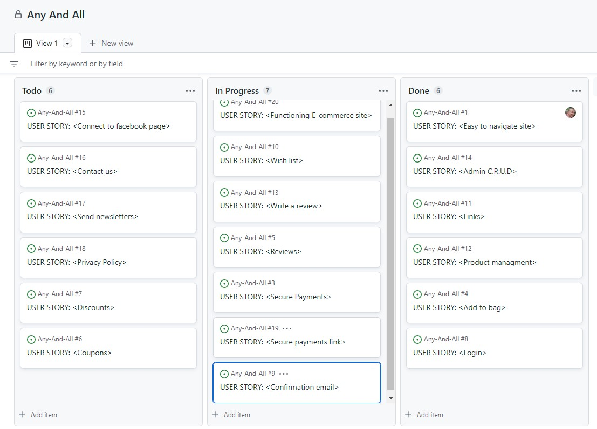

---

- [Back to top ^](#any-and-all)

 # Content Requirements:
    
- ## The UI/UX **MUST** address these:

    - Functioning E-commerce site.
    - Easy site navigation with search bar.
    - Connect to facebook page.
    - User and staff C.R.U.D functionality.
    - Correctly coded links.
    - Add to bag functionality.
    - Easy sign up, Log in and Log out system.
    - Authentication, user must not be able to edit or delete anyone else's reviews or access edit product are page.
    - Secure Payments.

- ## The UI/UX **SHOULD** address these:
    
    - Privacy Policy access.
    - Send an email of order confirmation.
    - Leave a review.
    - Subscribe newsletters.
    - Contact us easily.
    - See other peoples reviews.
    - Write a review.
    - Add items to a wish list.
    - Receive a confirmation email.
    - Login for ease of second visit.
    - Discounts products.

- ## The UI/UX **COULD** address this:

    - Secure payments link to see how Stripe works.

- ## The UI/UX **WON'T** address this:

    - Coupons will not be added at this time. 

## All of the above user stories were met except coupons marked as Won't Have.

- [Back to top ^](#any-and-all)

---

# The bare bones:

## Wireframes: Created using https://balsamiq.com/wireframes/

The wire frames for the pages showcasing the bare structure of the site.

### Links to the other pages:
- [Products Page](documentation/readme/any-and-all-wireframe2.jpg)
- [Products detail Page](documentation/readme/any-and-all-wireframe3.jpg)
- [Products management Page](documentation/readme/any-and-all-wireframe4.jpg)
- [Profile page](documentation/readme/any-and-all-wireframe5.jpg)
- [Sign up page](documentation/readme/any-and-all-wireframe6.jpg)
- [Sign in page](documentation/readme/any-and-all-wireframe7.jpg)
- [Sign out page](documentation/readme/any-and-all-wireframe8.jpg)
- [Shopping bag page](documentation/readme/any-and-all-wireframe9.jpg)
- [Secure checkout page](documentation/readme/any-and-all-wireframe10.jpg)
- [Reviews page](documentation/readme/any-and-all-wireframe11.jpg)
- [Wishlist page](documentation/readme/any-and-all-wireframe12.jpg)

---

- [Back to top ^](#any-and-all)

----

# Database Schema:

## ***`Draw SQL`*** 
I used https://drawsql.app/ to create the project's database schema showing the relationship between the models.

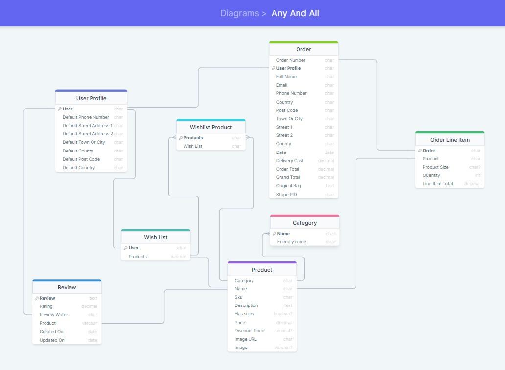

#### Models
- ***UserProfile*** - Stores all users details and purchase history also links the user to the reviews and wish list models.
- ***Category*** - Attaches a category to the products and also links to the wish list product model.
- ***Product*** - Stores the product information and links to the wish list, wish list product, review, category and order line item models.
- ***Order*** - Creates the users order details and links to the user profile and order line item models.
- ***OrderLineItem*** - Are the products in the order which links to the order and product models.
- ***WishlistProduct*** - Stores the wish list items which links to the wish list and product models.
- ***Wishlist*** - Attaches the user to the wish list which links to the user profile, wish list product and product models.
- ***Review*** - Creates a review for the customer to review the item and/or read other people's reviews and connects to the user profile and the product models.

---

- [Back to top ^](#any-and-all)

# Marketing strategy:

## ( ***`SEO`*** ) Search Engine Optimization:
- I've added some short tail and long tail keywords in the Meta tag then a nice caption on the front page with highlighted keywords telling the users about the site.
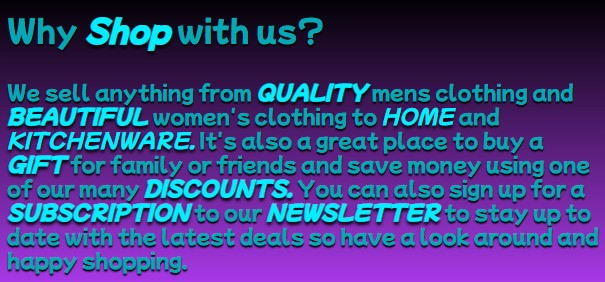

- I've also added a robots.txt and a sitemap.xml to maximize google search engines.
- I've also created a newsletter subscription function

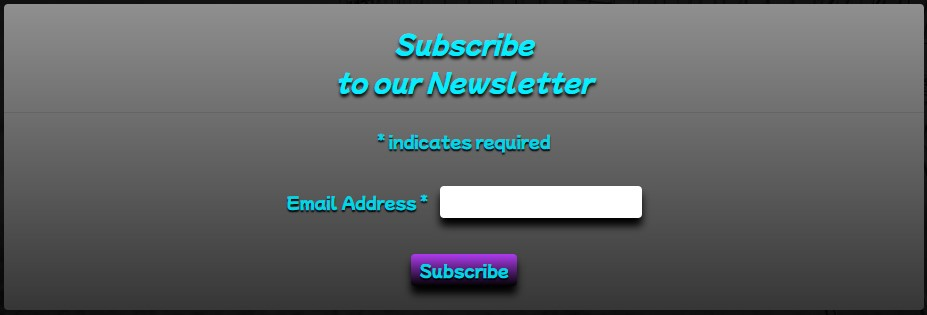

---

## ***`Brand Reach`***:

## ***`Facebook`*** Business page:

The site has a Facebook Business page to help the business reach further and gain potential customers and updates and discounts can be advertised to entice the shoppers to come and visit the site.

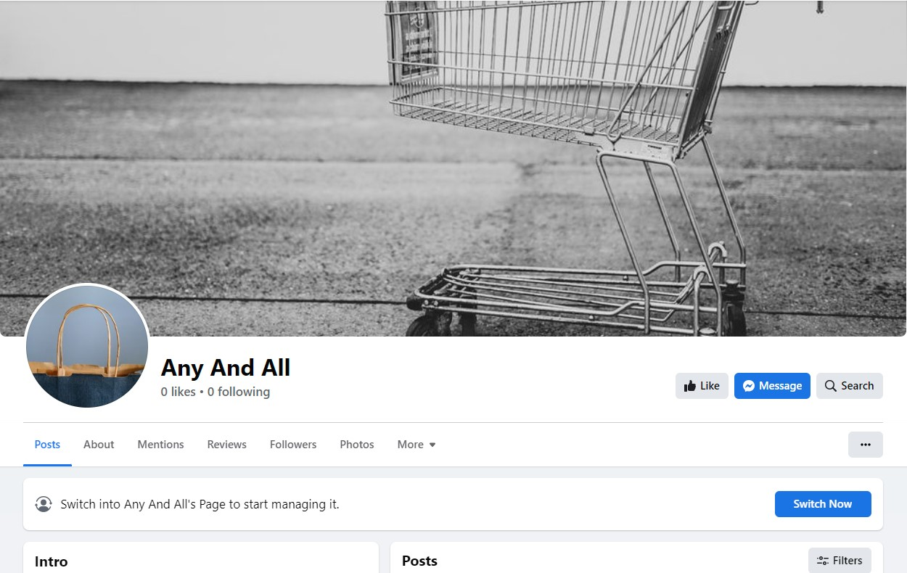

---

- [Back to top ^](#any-and-all)

# Technologies Used:

## Languages & Frameworks:
-  - The bare structure of the site.
-  - For quick inline styling in HTML code.
-  - The styling and positioning of the HTML.
-  - The interactivity of the site.
-  - The backend functionality.
-  - To build the project.
-  - To deploy the live site.
-  - To store the project's code.
-  - To write and push the code for the project.
-  - To send emails.
-  - To create site's Facebook business page.
-  - As one of the social links.
-  - As another one of the social links.
-  - To help with code identification.
-  - To build the site in.
-  - To host static and image files.
-  - For questions and answers.
-   - To connect the project to the database.

## Others Dependencies :

- ***`Balsamiq`*** - To create project's wireframes.
- ***`Chrome Dev Tools`*** - To debug and testing.
- ***`W3C HTML Validator`*** - To validate the HTML code.
- ***`W3C CSS Validator`*** - To validate CSS code.
- ***`Am I Responsive`*** - To generate the responsive preview screens.
- ***`Font Awesome`*** - For the icons.
- ***`Google Fonts`*** - For font style.
- ***`Stripe`*** - To process the online payments with webhooks.
- ***`Sitemap`*** - To generate the sitemap.xml
- ***`Draw SQL`*** - To create the database schema diagram.

---

- [Back to top ^](#any-and-all)

# Existing Features:

# The landing page:

I've designed the site with a purple and black gradient to add style with a beautiful eye catching blue accents to draw attention and really stand out.
The Logo will take the user back to the home page.
I've also added the Home link along side the All products, Clothing, Homeware and Special offers Categories in the nav links which light up when hovered or clicked to make it simple for all levels of user's
It has a search bar for searching anything on the site quickly using keywords.
The large dark footer makes the blue really pop for easy guidance to links and can be found on all pages.

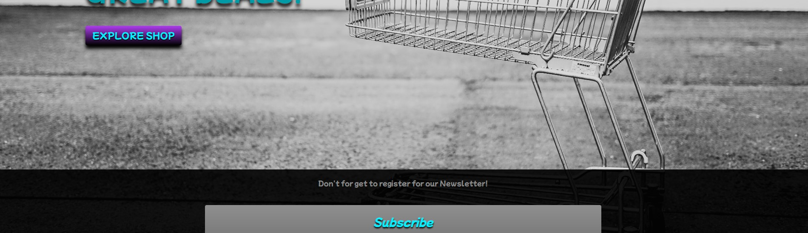
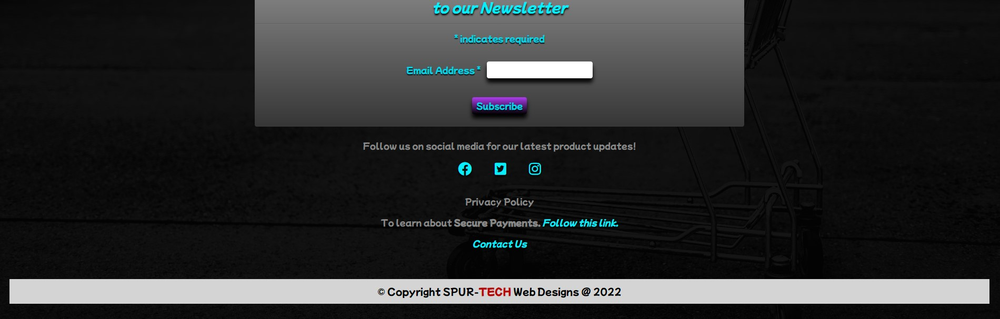

- [Back to top ^](#any-and-all)

---

# The Navbar:

The nav bar can be seen on all pages and collapses down for tablets and mobile devices.

## The My accounts link will drop down to show:
- The user who is currently logged in.
- The My profile link that takes the user to their own profile page.
- The My wish list link that takes the user to their wish list page.
- The Sign out link that takes the user to the Sign out page.

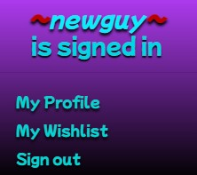

## Depending on authentication:
- The Edit item is only seen when staff authentication is active.

The Bag link takes the user to the Shopping Bag page showing the items selected by the user for purchase.
which is fully adjustable and has a Secure checkout and a Keep shopping Button.

---

- [Back to top ^](#any-and-all)

## The All Products link drops down to show: ~
- By Price.
- By Category.
- All Products .
All links have a nice hover effect for better UI/UX.

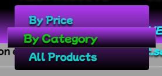

## The Clothing link drops down to show: ~
- Activewear & Essentials.
- Jeans.
- Shirts.
- All Clothing.

## The Special Offers link drops down to show: ~
- New Arrivals.
- Deals.
- Clearance.
- All Specials.

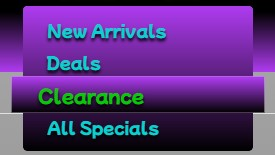

## Then finally the Free Delivery Banner.

---

## In the body is a Keyword Caption to assist with SEO (Search Engine Optimization).

## Then the main header and the Explore shop button.
- Explore shop button Takes the user to the all products page.

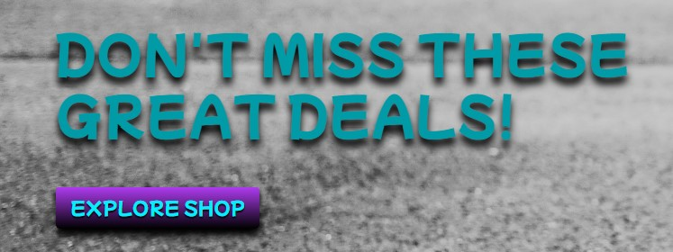

---

- [Back to top ^](#any-and-all)

# Footer:

## The footer can be found on all pages and consists of: ~

- ### The Subscription for the Newsletter.
    - The user will then receive a thank you for subscribing email.
- ### The social link.
   - which takes the user to the Facebook Business page and Twitter and Instagram pages.
- ### The Privacy Policy link.
    - which takes the user to the Privacy Policy page.
- ### The link to Secure Payment info.
    - which takes the user to the Stripe website.
- ### The Contact us link.
    - which takes the user to the contact us form.
- ### Then the Copyright tag.
 I've used this in all my projects as a tag to indicate all sites were create by SPUR-TECH Designs for a realistic look.

---

- [Back to top ^](#any-and-all)

# Contact us page:

## Contact page was built on MailChimp site: ~

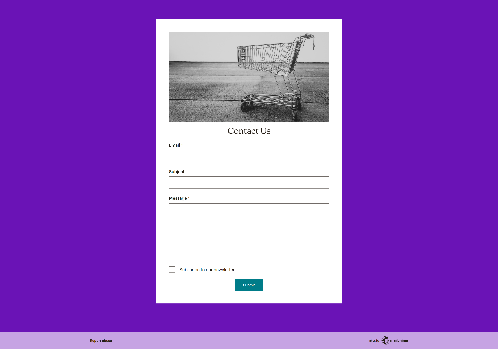

---

- [Back to top ^](#any-and-all)

# The Product page:

## Contains: ~
- All Product images.
- Product names and Descriptions.
- The prices and Discount Prices if item is discounted.

- A back to top button in bottom left corner 

- ## The Category tags.
    - Which takes the user to all products with the same category.

- ## Add To Bag link.
    - Which takes the user to the product details page which contains further details like size and quantity etc.

- ## The Reviews link.
    - Which takes the user to the product details page which contains the review section.

- ## The Wish list link.
    - Which adds the item to the Wish list page if the user is logged in otherwise the user is prompted to log in or register.

    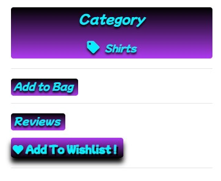

- ## If user is Staff User.
    - Links to the edit product will appear at the bottom.
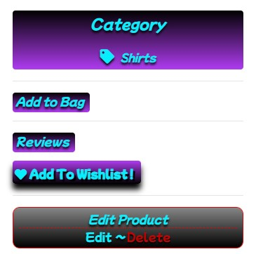

---

- [Back to top ^](#any-and-all)

# Product Detail Page:

## Contains: ~
- An individual image of selected product.
- Product name and price or Discount price.
- The category.
- The Description.
- The add to Wish list link.
- The Quantity selector.
- Add to bag Button.
- Keep Shopping Button.
- Reviews.

By clicking on ***`Write Review`*** the user will be taken to the review form if the user is logged in or the user will be directed to the log in form.

By clicking on ***`Add To Wish list`*** the user will be notified that the item was added to their Wish list page if the user is logged in or the user will be directed to the log in form.

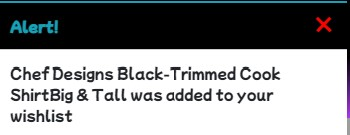

---

- [Back to top ^](#any-and-all)

# Sign in page:

## Contains: ~
- Username.
- Password.
- Remember me check box.
- Home Button.
- Sign in Button.
- Forgot password link.

At the top is a prompt to ask the user to register if not already done so.

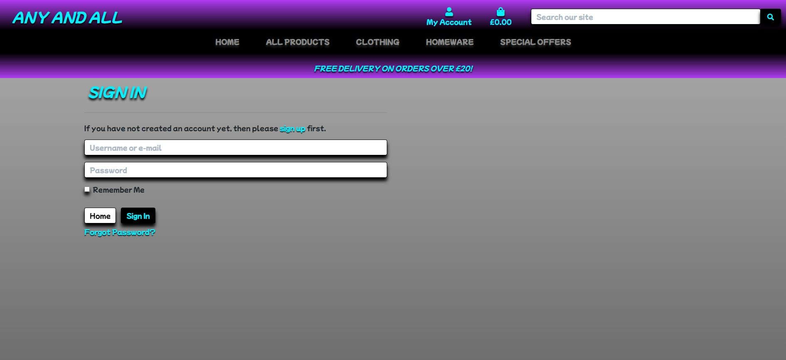

---

- [Back to top ^](#any-and-all)

# Sign up page:

## Contains: ~
- Email.
- Re-enter Email.
- Username.
- Password.
- Confirm Password.
- Back to Login Button.
- Sign up Button.

At the top is a prompt to ask user to Login if already registered.

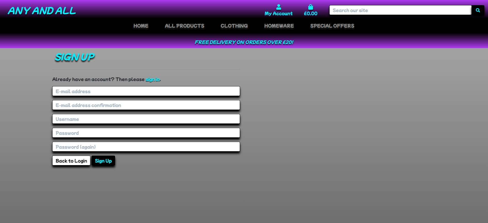

---

- [Back to top ^](#any-and-all)

# Bag Page:

## Contains: ~
- An image of selected products.
- Product description, Price or Discount Price, Quantity selector and subtotal.
- Size if applicable.
- Subtotal, Delivery cost and Grand Total.
- Secure Checkout and Keep Shopping Button.

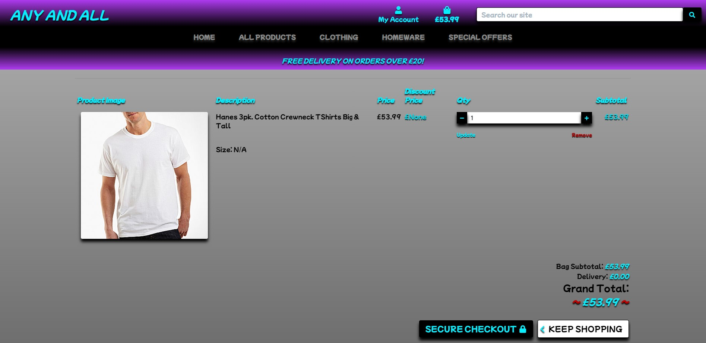

## which also collapses down for smaller screens sizes like all the other pages.

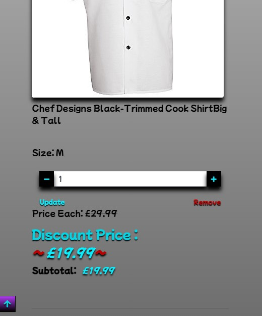

## The user is alerted each time an item is added to  or removed from the bag.

## The empty bag will notify the user and a KEEP SHOPPING button will bring the user to the Products page. 

---

- [Back to top ^](#any-and-all)

# Checkout page:

## If the user is not registered: ~

The form will be blank.

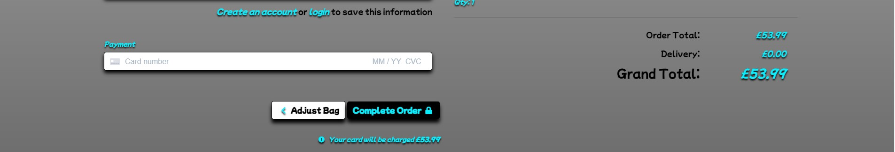

## If the user is registered and signed in: ~

The form will be filled out except Full Name and card details for security reasons.

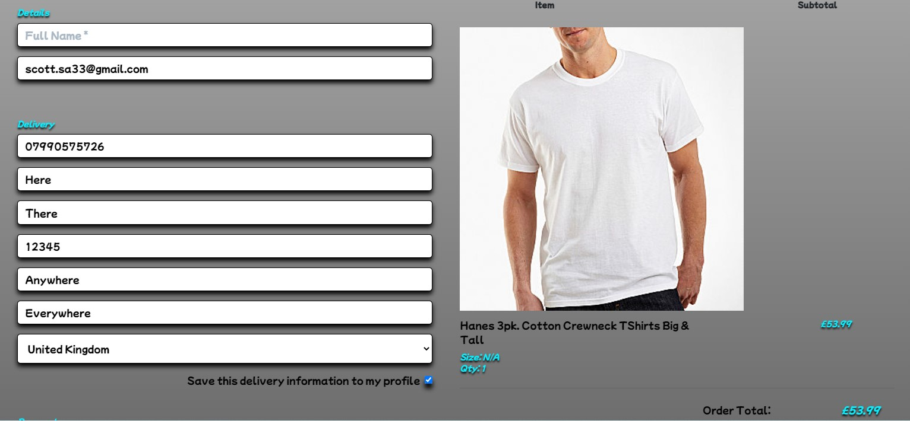

The items can still be adjusted at this point.

---

- [Back to top ^](#any-and-all)

# Loading Page:

## When the Complete Order Button is pressed the user is greeted with a loading page.

---

- [Back to top ^](#any-and-all)

 ## Then directed to the: ~

 # Thank you page:
 
 With a message notifying them of the order number and purchase details being sent to their Email Address.
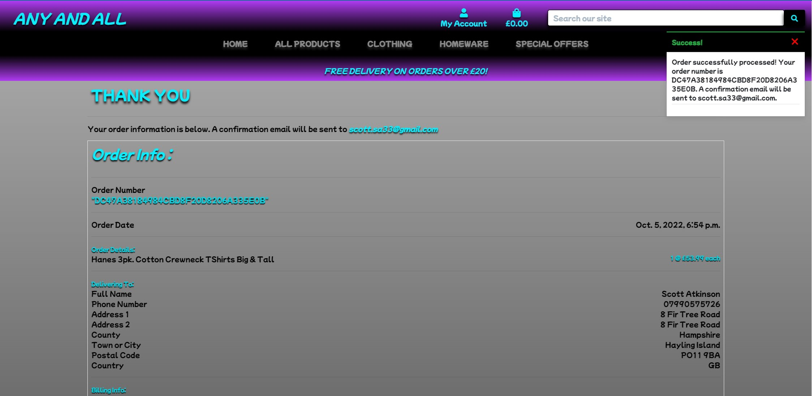

---

- [Back to top ^](#any-and-all)

## Confirmation Email

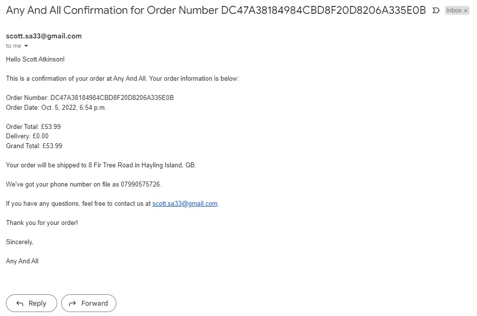

---

- [Back to top ^](#any-and-all)

# Testing:

- I have manually tested every part of the functionality every step of the way.
- I add a new MODEL, VIEW, TEMPLATE and link the URLS, I then check all is as it should be.
- Each time I write a new line of HTML, CSS OR JAVASCRIPT I check to see if it looks and acts how I expect it to.
- With the HTML and CSS I targeted certain classes by adding a solid color background to be sure I'm targeting the right section then continue with the styling.
- With the JAVASCRIPT I write a small piece of code then console log the result to make sure the result is as I expected before continuing.
- I then tested the functionality of said code for instance if it's a button then that button must send the correct data and redirect the user to the relevant page.
- I made sure that if the user is authenticated then the log out will display in the NAVBAR under MY ACCOUNT dropdown and the relevant buttons are shown in the BAG.
- I made sure that all buttons to delete item and any other buttons tah could edit items are removed if the user is not authenticated and an error message appears if user try's to access forbidden area's.
- I deployed the site early so I could physically check the media queries were coded correctly to have the responsive ability required and the CSS, DATABASE and IMAGES displayed correctly.
- I then ask friends and family to use the site with no instruction to see from a different perspective and ideas from real people for bug hunting and improvements also to see if the site worked correctly across multiple devices.
- Tests were made to ensure the role based user could add, delete or update the PRODUCTS successfully.
- Tests were also made to ensure the user could add, delete or update their BAG, REVIEWS and WISHLISTS successfully and not access any other REVIEWS and WISHLISTS made by others.
- I added an item to the bag then deleted the item from the database to see if the item is removed from bag after dealing with the errors found The item now deletes from the bag with no errors.
- Testing the add to bag function  making sure no less than 1 and no more than 99 can be added.
- I tested to see if emoji's can be added in the reviews and (Yes they can).
- I tested the responsiveness on all screen sizes.
- Every page was put through the W3C HTML Validation checker and after working through all that was marked up in the code was where id's were repeating but the id's are needed so no changes were made and all is working correctly.
- I created multiple custom error pages, pushed them to Heroku then tested them by trying to access restricted area's and miss spelling the URL to see the desired error page.

## HTML Tests:

- ### Links to the other test results:

- [W3C HTML Validation Bag results](documentation/readme/any-and-all-html-validator-bag.jpg)
- [W3C HTML Validation Checkout results](documentation/readme/any-and-all-html-validator-checkout.jpg)
- [W3C HTML Validation Checkout success results](documentation/readme/any-and-all-html-validator-checkout-success.jpg)
- [W3C HTML Validation Home results](documentation/readme/any-and-all-html-validator-home.jpg)
- [W3C HTML Validation Products results](documentation/readme/any-and-all-html-validator-products.jpg)
- [W3C HTML Validation Product Detail results](documentation/readme/any-and-all-html-validator-product-detail.jpg)
- [W3C HTML Validation Review Form results](documentation/readme/any-and-all-html-validator-review-form.jpg)
- [W3C HTML Validation Review Edit results](documentation/readme/any-and-all-html-validator-review-edit.jpg)
- [W3C HTML Validation Review Confirm Delete results](documentation/readme/any-and-all-html-validator-review-confirm-delete.jpg)
- [W3C HTML Validation Wish List results](documentation/readme/any-and-all-html-validator-wishlist.jpg)
- [W3C HTML Validation Profile results](documentation/readme/any-and-all-html-validator-profile-page.jpg)
- [W3C HTML Validation Contact Form results](documentation/readme/any-and-all-html-validator-contact-form.jpg)

## CSS Test:

- The CSS was also put through the W3C CSS Validation checker with no errors or warnings.

- I then tested the site on Safari, Firefox and Chrome to make sure all was working correctly.

- Testing the sites Performance, Accessability, Best Practices and SEO on Devtools Lighthouse.

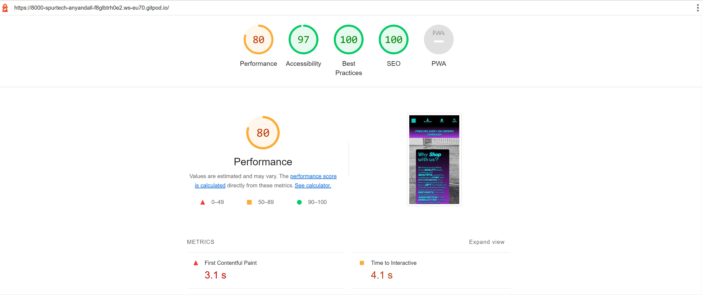

- Testing the sites Accessability on Wave. https://wave.webaim.org/

- No errors found but contrast as it dose not pick up my grey overlay but all blue text stands out nicely.

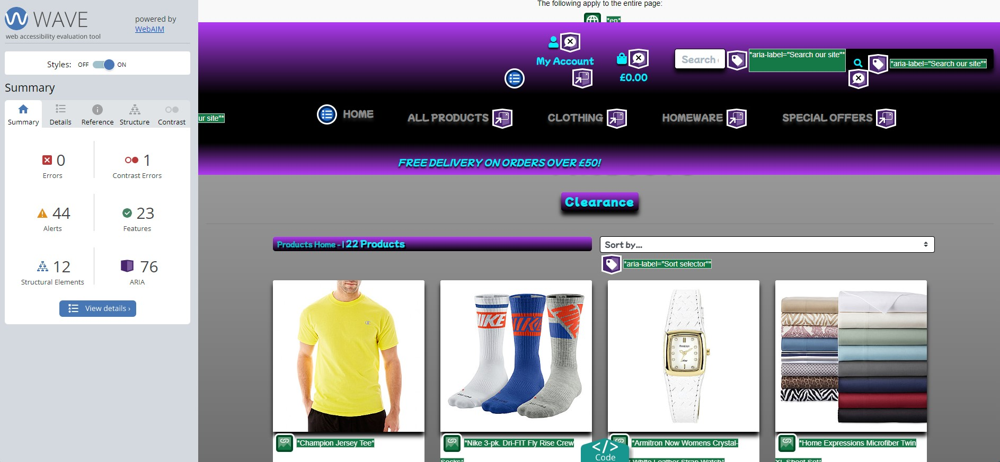

## As seen in the image below.

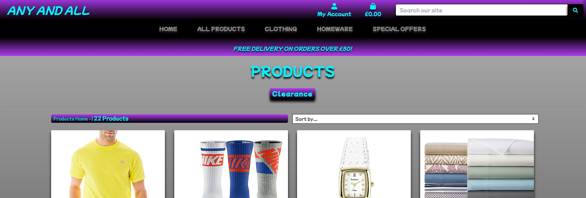

- Two links go to the same page which is the product management page which is correct.

---

- [Back to top ^](#any-and-all)

# Bugs And Fixes:

## Bug: ~ 
Header Title over run purple background on smaller screens if word is too long like (Management).
## Fix: ~ 
Remove purple background and add shading instead.
## Bug: ~ 
Long words breaking on smaller screens.
## Fix: ~ 
Individually target headers to control font size.
## Bug: ~ 
Due to controlling individual words the hover effect didn't work.
## Fix: ~ 
Add individual hover effects.
## Bug: ~ 
Order number over running screen on smaller devices.
## Fix: ~ 
Add a break in the number with the (truncatechars:6) technique in the HTML.
## Bug: ~ 
Reviews all crunched up if a long sentence was written.
## Fix: ~ 
Added line height to reviews text.
## Bug: ~ 
When deleting an item from the database throws an error if user has that item in their bag.
## Fix: ~ 
I had return item or 404 in context.py which I changed to (try: product = Product.objects.get(pk=item_id)except Product.DoesNotExist:continue). This did the trick.
## Bug: ~ 
Product not found in database on checkout was stopping the checkout process after doing the delete item from database test.
## Fix: ~ 
After printing to console after each line of code in the BAG, CHECKOUT, PRODUCTS and CONTEXT.PY files I just cleared cookies in the browser and all worked fine. It must have had an invalid item hidden somewhere.
## Bug: ~ 
Country field in checkout info was getting cut off at the bottom.
## Fix: ~ 
Make country field box slightly larger in height to fit.
## Bug: ~ 
Validation results wanted me to remove some random closing P tags ?.
## Fix: ~ 
Remove suggested closing P tags.
## Bug: ~ 
Remove item from wishlist button was getting cut off slightly on mid size screens
## Fix: ~ 
Move button into description area and it looks much better too.

---

- [Back to top ^](#any-and-all)

# Credits:

## Many thanks to:~

- ## ***`Code Institute`***:~ 
for supplying the materials to follow along with and the opportunity to become a ( ***`FULL STACK DEVELOPER`*** ).  
- ***`Tutor Support`*** :~ for being there in my many many times of need especially ***`Scott`***. He was so quick at finding errors saving me valuable Tutor time and helping me understand why the errors occur.
- ***`Jack Wachira`*** :~ for Mentoring me through the course.
- ***`My Family and Friends`*** :~ for testing and constructively criticizing the site in depth to help me create a better UI/UX.
- ***`Chris_W_Alumnus`*** :~ for helping me work around the Reviews section of the project.
- ***`liz conway_5P`*** :~ for taking the time to review my project in the Peer code review on Slack.
- ***`Stack Overflow`*** :~ for providing questions and answers at difficult times.
- ***`TomDoesTech`*** :~ for making a Youtube video on how to add Technology badges to my Readme.

---

- [Back to top ^](#any-and-all)

# Deployment:

This project was developed in Visual Studio Code using GitPod workspace. The code was committed to Git and pushed to GitHub in the terminal.

## Deploying to Heroku:

To deploy this page to Heroku from its GitHub repository, the following steps were taken:

1. Create the Heroku App:
    - Select "Create new app" in Heroku.
    - Choose a name for your app and location.

2. Attach the Postgres database:
    - In the Resources tab, under add-ons, type in Postgres and select the Heroku Postgres option.

3. Prepare the environment and settings.py file:
    - In the Settings tab, click on Reveal Config Vars and copy the url next to DATABASE_URL.
    - In your GitPod workspace, create an env.py file in the main directory. 
    - Add the DATABASE_URL value and your chosen SECRET_KEY value to the env.py file.
    - Add the SECRET_KEY value to the Config Vars in Heroku.
    - Update the settings.py file to import the env file and add the SECRETKEY and DATABASE_URL file paths.
    - Repeat this process with the;~
        - AWS ACCESS KEY ID.
        - AWS_SECRET_ACCESS_KEY.
        - STRIPE_PUBLIC_KEY.
        - STRIPE_SECRET_KEY.
        - STRIPE_WH_SECRET.
        - EMAIL_HOST_PASS.
        - EMAIL_HOST_USER.
    - In settings.py add the following sections:
        - SITE_ID = 1
        - AWS ACCESS KEY ID
        - AWS_storage
        - allauth
        - allauth.account
        - allauth.socialaccount
        - STATICFILE_STORAGE
        - STATICFILES_DIRS
        - STATIC_ROOT
        - MEDIA_URL
        - DEFAULT_FILE_STORAGE
        - TEMPLATES_DIR
        - Update DIRS in TEMPLATES with TEMPLATES_DIR
        - Update ALLOWED_HOSTS with ['app_name.heroku.com', 'localhost']
        - Ensure that DEBUG is set t False

## Add Stripe Details for payments

4. Payment details in Setting.py:
- FREE_DELIVERY_THRESHOLD = 20
- STANDARD_DELIVERY_PERCENTAGE = 10
- STRIPE_CURRENCY = 'gbp'
- STRIPE_PUBLIC_KEY = os.getenv('STRIPE_PUBLIC_KEY', '')
- STRIPE_SECRET_KEY = os.getenv('STRIPE_SECRET_KEY', '')
- STRIPE_WH_SECRET = os.getenv('STRIPE_WH_SECRET', '')

## Add the INSTALLED_APPS in settings.py file:

5.Installed APPS in Settings.py: 
- 'home',
- 'products',
- 'bag',
- 'checkout',
- 'profiles',
- 'wishlist',

## Override Static and Media files to be stored in AWS and Deploy to Heroku:

6. Static and media files:
    - STATIC_URL = f'https://{AWS_S3_CUSTOM_DOMAIN}/{STATICFILES_LOCATION}/'
    - MEDIA_URL = f'https://{AWS_S3_CUSTOM_DOMAIN}/{MEDIAFILES_LOCATION}/'

## Create a requirements.txt file:

7. Requirements:
    - Create a file named "Procfile" in the main directory and add the following:
    - web: gunicorn project-name.WSGI
    - Log in to Heroku using the terminal Heroku login -i.
    - Then run the following command: **heroku git:remote -a your_app_name_here** and replace your_app_name_here with the name of your Heroku app. This will link the app to your Gitpod terminal.
    - After linking your app to your workspace, you can then deploy new versions of the app by running the command **git push heroku main** enter your app name and Heroku API Key when prompted and your app will be deployed to Heroku.
    - Then go to Heroku and click on your new app and then click open app. 

## Finally create a robots.txt file 
- To control search engine bot crawling.
## A sitemap.xml file
- To allow search engine bot crawling.

---

- [Back to top ^](#any-and-all)